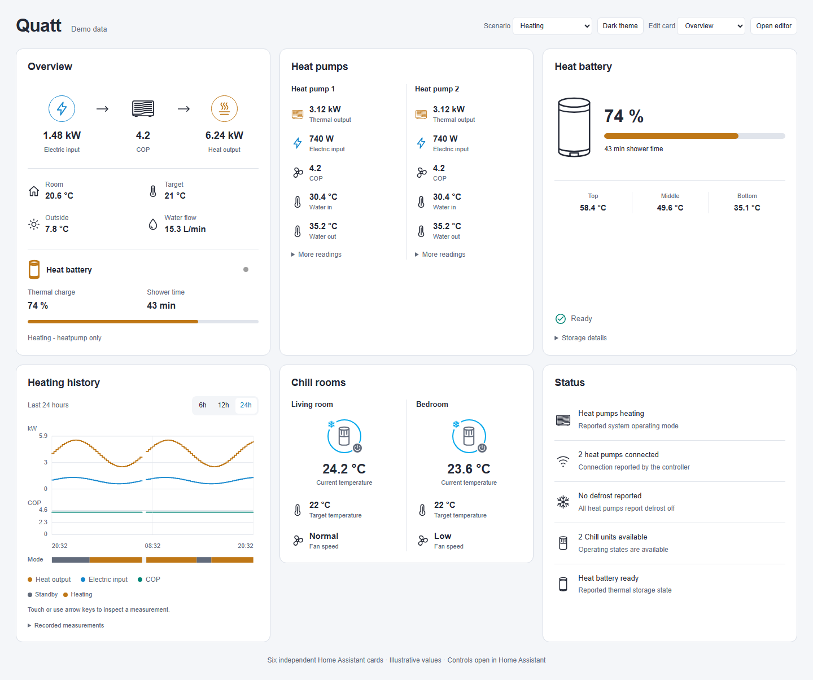
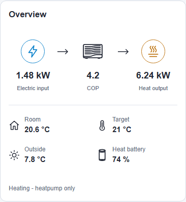

# Quatt Cards

Compact Home Assistant dashboard cards for the [Quatt integration by marcoboers](https://github.com/marcoboers/home-assistant-quatt). The collection continues the typography, compact layouts, inline charts, and Home Assistant theme support of [Omnibattery Cards](https://github.com/thomasvt1/omnibattery-cards), with visual inspiration from [EMHASS Companion](https://github.com/smefa/emhass-ha-companion).

[](https://github.com/thomasvt1/quatt-cards/actions/workflows/ci.yml) [](https://github.com/thomasvt1/quatt-cards/releases/latest)

## Cards

| Card | Custom element | Content |
| --- | --- | --- |
| System overview | `custom:quatt-overview-card` | Heat output, electrical input, reported COP, comfort readings, and a compact heat-battery summary. |
| Performance history | `custom:quatt-history-card` | Recorded heat output, electrical input, COP, and a slim operating-mode timeline over the last 6, 12, 24, or 48 hours. |
| Heat pumps | `custom:quatt-heat-pump-card` | All heat pumps or one selected unit, with power, temperatures, and available operating details. |
| Heat battery | `custom:quatt-heat-battery-card` | Thermal charge level, available shower time, temperatures, and available charging information. |
| Chill | `custom:quatt-chill-card` | All Chill units or one selected unit, with available temperature, fan, operating information, and native controls. |
| System status | `custom:quatt-status-card` | Reported operating state, connectivity, defrost, limits, and available faults. |

All cards have a visual configuration editor, card-picker preview, YAML configuration, and Sections/Masonry sizing. Heat pump and Chill collections support three styles: **C · Columns** by default, **A · Stacked**, and **B · Compact**. Columns uses at most three units per row; further units wrap onto new rows. A single visible unit uses two reading columns across the card.

Interactions inspect chart readings or open Home Assistant sensor details. Each Chill unit has a centered, clickable **Chill status ring** that opens its native Home Assistant climate panel. Use that panel to change target temperature, heating/cooling/off mode, and fan speed. Opening it does not change the unit; commands are handled by Home Assistant when you use its controls. The other cards remain display-only.



[Single-unit layout](docs/screenshots/single-desktop-light.png) · [Single unit on phone](docs/screenshots/single-phone-dark.png) · [Dark theme](docs/screenshots/desktop-dark.png) · [Phone, light theme](docs/screenshots/phone-light.png) · [Phone, dark theme](docs/screenshots/phone-dark.png)

## Requirements

- Home Assistant 2026.10 or newer, matching the package's declared HACS minimum.
- The Quatt integration installed and exposing sensor entities.
- Home Assistant Recorder history for the performance history card. An entity excluded from Recorder cannot provide a complete history.

Discovery is based on the integration registry and upstream stable identifiers rather than entity display names. Renaming an entity does not break discovery. Select an installation explicitly when multiple Quatt integration entries are present.

The data adapter targets the upstream entity contract at [commit ac6d26ab5ee8083e9cacf2391b5cfa0ae98fa4cf](https://github.com/marcoboers/home-assistant-quatt/tree/ac6d26ab5ee8083e9cacf2391b5cfa0ae98fa4cf). Available fields depend on equipment, integration configuration, local/remote access, and enabled entities. Remote-only metrics can be absent in a local-only installation. Missing optional devices and readings are omitted or marked unavailable.

## Install through HACS

1. Open **HACS → Custom repositories**.
2. Add `https://github.com/thomasvt1/quatt-cards` with type **Dashboard**.
3. Find **Quatt Cards** and download the latest release.
4. Reload Home Assistant, then search for **Quatt** in **Add card**.

[Open this repository in HACS](https://my.home-assistant.io/redirect/hacs_repository/?owner=thomasvt1&repository=quatt-cards&category=plugin)

HACS normally registers the module automatically. If your resources are managed manually, add `/hacsfiles/quatt-cards/quatt-cards.js` as a **JavaScript Module**, with a version query when updating. Avoid duplicate manual and HACS resources.

## Install manually

1. Build the asset with `npm ci` and `npm run build`.
2. Copy `dist/quatt-cards.js` to `/config/www/quatt-cards.js` on Home Assistant.
3. Add a dashboard resource with URL `/local/quatt-cards.js?v=0.5.0` and resource type **JavaScript Module**.
4. Reload the browser. In **Add card**, search for **Quatt**.

For dashboards with YAML-managed resources:

```yaml
resources:
  - url: /local/quatt-cards.js?v=0.5.0
    type: module
```

The bundle contains Lit and SVG chart code. It requires no external runtime assets or chart-card plugins. Change the URL version when replacing the asset to avoid a stale browser cache.

### HACS packaging

`hacs.json` declares `quatt-cards.js` as the release asset. Tagged releases run the included checks and attach the self-contained bundle to the [GitHub release](https://github.com/thomasvt1/quatt-cards/releases/latest).

Avoid loading both a manual `/local/` resource and a HACS resource for the same package. This is a HACS custom repository; submission to HACS's default catalog is separate.

## Configuration

The visual editor discovers installation and device choices. Empty entity fields restore automatic discovery. Device selectors use Home Assistant device registry IDs, not sensor IDs.

```yaml
type: custom:quatt-overview-card
title: Heating
```

```yaml
type: custom:quatt-history-card
title: Heating performance
hours: 24
```

```yaml
type: custom:quatt-heat-pump-card
layout: columns
# Omit device to show all units in the selected installation.
# device: YOUR_HEAT_PUMP_DEVICE_ID
```

| Option | Applies to | Default | Purpose |
| --- | --- | --- | --- |
| `type` | All | Required | One of the six custom element names above. |
| `title` | All | Card's own title | Optional heading. |
| `integration_id` | All | Automatic | Quatt config-entry ID selected in the visual editor. |
| `device` | Heat pumps, Chill | All units | Restrict the card to one device registry ID. |
| `heat_battery_layout` | Overview | `detailed` | `detailed` keeps the separate section and charge bar; `minimal` puts battery readings in the main reading grid. |
| `fields` | All cards | Card defaults | Map field keys to `true` or `false`; also available under **Displayed fields** in the visual editor. |
| `show_controls` | Chill | `true` | Make each Chill icon clickable to open controls. Set `false` to keep the icon decorative and the card display-only. |
| `layout` | Heat pumps, Chill | `columns` | `columns`, `stacked`, or `compact`. |
| `hours` | History | `24` | Recorded window: `6`, `12`, `24`, or `48`. |
| `entities` | All | Automatic | Map supported metric roles to explicit sensor entity IDs. |

Entity overrides affect system readings on overview, history, and status cards; thermal battery readings on the heat battery card; and the explicitly selected unit on heat pump/Chill cards. Select a unit before configuring unit overrides. An override configured on one card does not change another card or the Quatt integration.

Example with generic sensor placeholders:

```yaml
type: custom:quatt-overview-card
entities:
  heatPower: sensor.your_quatt_heat_output
  electricPower: sensor.your_quatt_electrical_input
  cop: sensor.your_quatt_cop
```

The editor exposes relevant supported roles for each card. Common system roles include `heatPower`, `electricPower`, `cop`, `roomTemperature`, `targetTemperature`, `outdoorTemperature`, `supplyTemperature`, `returnTemperature`, and `flowRate`. Thermal battery roles include `charge`, `showerMinutes`, `topTemperature`, `middleTemperature`, `bottomTemperature`, `charging`, `hotWater`, and `boost`. Separate charger readings are discovered from the heat charger device. Use actual sensor values with appropriate units. Do not use electrical battery charge sensors as thermal storage sources.

See [examples/dashboard.yaml](examples/dashboard.yaml) for a complete six-card Sections dashboard. Examples use generic identifiers. Review any example before adding it to an existing dashboard.

## Data and chart behavior

- Heat output is thermal power. Electrical input is electricity consumed. They remain distinct even when their numerical values are similar.
- Heat battery charge represents **thermal storage**, not an electrical home battery. No stored electrical energy is inferred from its percentage or temperatures.
- COP is shown from the integration's reported metric. The frontend does not invent a COP from missing or incompatible readings.
- History shows recorded measurements, not a forecast. Unavailable readings remain gaps rather than being replaced with zero.
- A single operating-mode strip shares the chart's time axis. Known local controller modes receive distinct labels; missing and unsupported modes remain gaps. Adjacent intervals with the same mode are joined.
- Historical data is read through Home Assistant and uses its time zone for labels, including daylight-saving changes. Numbers follow the Home Assistant locale.
- Chart inspection works with pointer, touch, and keyboard. Cards inherit theme colors and respect reduced motion.
- Device readings are scoped to the selected installation. A partial set of available heat pumps must not masquerade as a complete system total.
- This release does not turn Quatt Insights or lifetime counters into daily energy totals, predict savings, or calculate an optimization plan. Quatt remains responsible for equipment behavior and all upstream calculations.
- Electrical Home Battery and Energy product cards are outside this initial collection.

Registry discovery and history requests are shared across cards where possible. Cards release subscriptions when removed. Registry changes trigger fresh discovery, including entity renames.

## Development

Use Node.js 24 or newer.

```sh
npm ci
npm run dev
npm run check
npm test
npm run build
npx playwright install chromium
npm run test:browser
```

The development preview and screenshots use synthetic fixtures. Tests cover data discovery and units, unsupported or missing telemetry, and browser behavior across supported card layouts. CI runs type checking, unit tests, a production build, and Chromium browser tests. See [validation notes](docs/validation.md) for the checked environments and remaining live-installation boundary.

Keep personal Home Assistant identifiers, credentials, raw diagnostics, and local installation files out of commits. `.local/` is ignored for private verification artifacts.

## License and credits

Licensed **AGPL-3.0-or-later**; see [LICENSE](LICENSE). Derived frontend patterns from [Omnibattery Cards](https://github.com/thomasvt1/omnibattery-cards) are retained under that license. [EMHASS Companion](https://github.com/smefa/emhass-ha-companion) supplied visual inspiration. [marcoboers/home-assistant-quatt](https://github.com/marcoboers/home-assistant-quatt) supplies the integration and entity contract; this frontend is a separate project and is not an official Quatt product.

Bundled Lit license notices are preserved in [THIRD_PARTY_NOTICES.txt](THIRD_PARTY_NOTICES.txt) and the generated JavaScript asset.

### Chill controls

Controls are discovered from each device’s enabled Quatt climate entity, independently of reading overrides. They work for a selected unit or all units in the card. The integration’s Quatt Remote Mobile API configuration is required. Missing or ambiguous climate entities and offline units disable the icon, with an explanation in its tooltip. Home Assistant supplies the supported modes, fan options, temperature limits, permissions, and service error handling. No command is sent when opening the panel.

## Choose displayed fields

Open the card editor and expand **Displayed fields** to show or hide readings, history series, or status categories. **Reset displayed fields** restores that card’s defaults and preserves other settings. Selection applies to every visible device in a collection card. Hidden readings do not leave empty columns. Field selection affects presentation only; it does not change hardware or entity settings.

Chill combines status and mode in its device icon, removing the separate text rows. The ring is blue for selected cooling mode and red for heating; a snowflake or heat symbol also identifies the mode. A check means reported On/running, a power symbol means Off, a clock means idle/standby, and a question mark means unknown. Unavailable units use a neutral ring and warning badge. The ring shows the selected mode even while Off; it does not imply active cooling or heating. Tooltips and accessible descriptions retain the reported values. **Operating status** and **Operating mode** under Displayed fields toggle the icon indicators. Theme authors can override `--quatt-chill-cooling-color` (default `#00a9ed`) and `--quatt-chill-heating-color` (default `#e34d59`).

Overview includes a heat-battery summary when that equipment is discovered: thermal charge with a progress bar, shower time, and operating status. In the Detailed layout, its header status is a small dot: green for On and gray for Off, unavailable, or other states. Hover or inspect the accessible label for the reported status; selecting the dot opens sensor details. The Heat battery · status field controls its visibility. Tank temperatures, charging/hot-water indicators, charger input, and water pressure can be enabled separately. Missing charge never becomes a fabricated percentage.

```yaml
type: custom:quatt-overview-card
fields:
  cop: false
  flowRate: false
  heatBattery.charge: true
  heatBattery.showerMinutes: true
  heatBattery.topTemperature: true
  heatCharger.heaterPower: true
```

Heat pump **Operating status** is off by default because some installations do not report it. Enable it under **Displayed fields**, or set `fields: {status: true}`. An existing explicit `status: true` remains enabled; **Reset displayed fields** restores the off default.

Omitted keys use their defaults. An empty `fields: {}` also uses defaults. Explicit booleans are required; unsupported keys are rejected. Entity overrides choose reading sources, while `fields` chooses visibility. Heat-battery overview values are discovered from the battery/charger devices, independently of system-reading overrides.

| Card | Field keys |
| --- | --- |
| `custom:quatt-overview-card` | `electricPower`, `cop`, `heatPower`, `roomTemperature`, `targetTemperature`, `outdoorTemperature`, `flowRate`, `supplyTemperature` (off by default), `mode`, `heatBattery.charge`, `heatBattery.showerMinutes`, `heatBattery.status`, `heatBattery.topTemperature` (off by default), `heatBattery.middleTemperature` (off by default), `heatBattery.bottomTemperature` (off by default), `heatBattery.charging` (off by default), `heatBattery.hotWater` (off by default), `heatCharger.heaterPower` (off by default), `heatCharger.waterPressure` (off by default) |
| `custom:quatt-heat-pump-card` | `electricPower`, `cop`, `heatPower`, `returnTemperature`, `supplyTemperature`, `status` (off by default), `compressorSpeed`, `outdoorTemperature` |
| `custom:quatt-heat-battery-card` | `charge`, `showerMinutes`, `topTemperature`, `middleTemperature`, `bottomTemperature`, `status`, `heaterPower`, `waterPressure`, `charging`, `hotWater`, `boost` |
| `custom:quatt-chill-card` | `roomTemperature`, `targetTemperature`, `fanMode`, `status`, `mode`, `waterWarning` |
| `custom:quatt-history-card` | `electricPower`, `cop`, `heatPower`, `mode` |
| `custom:quatt-status-card` | `mode`, `connectivity`, `defrost`, `heatBattery`, `limits`, `alerts` |

### Minimal heat battery in Overview

Choose **Heat battery layout → Minimal · alongside other readings** in the Overview editor. Battery readings use the same cells as Room, Target, Outside, and Water flow, without a separate section or progress bar. **Displayed fields** works identically in both layouts; switching layouts preserves every field choice. Detailed remains the default for existing cards.

For a four-field grid with Room, Target, Outside, and heat-battery charge:

```yaml
type: custom:quatt-overview-card
heat_battery_layout: minimal
fields:
  flowRate: false
  heatBattery.showerMinutes: false
  heatBattery.status: false
```


